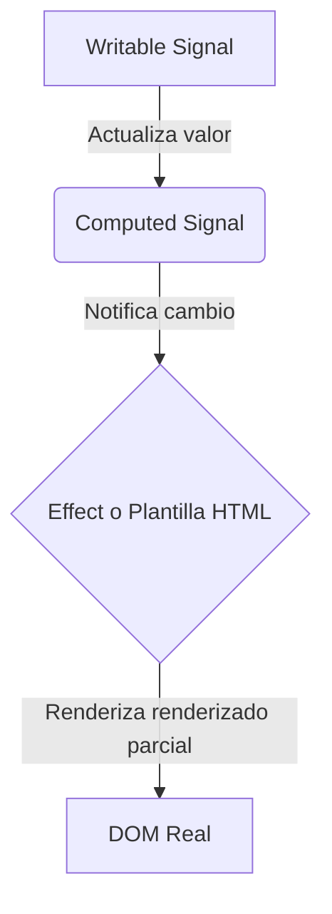

En esta guía detallada exploraremos **Angular Signals**, el nuevo paradigma de reactividad de grano fino introducido por el equipo de Angular. Descubriremos por qué representan un cambio tan radical en el rendimiento de Change Detection y cómo puedes adoptarlas hoy en tus proyectos Frontend.

---

# Configuración de Visual Studio Code

## ¿Por qué configurar VS Code?
Antes de adentrarnos en las Signals, es fundamental contar con un entorno de desarrollo optimizado. Configurar correctamente tu editor te permitirá escribir código más rápido, detectar errores de sintaxis en tiempo real y formatear tus archivos automáticamente según las mejores prácticas del ecosistema.

## Extensiones recomendadas
<div class="grid grid-cols-1 sm:grid-cols-2 gap-4 my-6">
  <div class="p-4 rounded-xl border border-white/5 bg-card-dark/40">
    <div class="flex items-center gap-2 mb-2">
      <span class="text-lg">🅰️</span>
      <h4 class="text-sm font-bold text-white font-display">Angular Language Service</h4>
    </div>
    <p class="text-xs text-text-muted">Proporciona un entorno enriquecido para las plantillas de Angular, incluyendo autocompletado y validación de tipos.</p>
  </div>
  <div class="p-4 rounded-xl border border-white/5 bg-card-dark/40">
    <div class="flex items-center gap-2 mb-2">
      <span class="text-lg">🔍</span>
      <h4 class="text-sm font-bold text-white font-display">ESLint</h4>
    </div>
    <p class="text-xs text-text-muted">Analiza estáticamente tu código TypeScript y HTML para identificar patrones problemáticos y asegurar el estilo.</p>
  </div>
  <div class="p-4 rounded-xl border border-white/5 bg-card-dark/40">
    <div class="flex items-center gap-2 mb-2">
      <span class="text-lg">✨</span>
      <h4 class="text-sm font-bold text-white font-display">Prettier</h4>
    </div>
    <p class="text-xs text-text-muted">Asegura un formateo consistente de tu código al guardar los archivos, eliminando discusiones de formato.</p>
  </div>
  <div class="p-4 rounded-xl border border-white/5 bg-card-dark/40">
    <div class="flex items-center gap-2 mb-2">
      <span class="text-lg">👁️</span>
      <h4 class="text-sm font-bold text-white font-display">Error Lens</h4>
    </div>
    <p class="text-xs text-text-muted">Resalta errores y advertencias directamente en la línea de código afectada sin necesidad de pasar el cursor.</p>
  </div>
  <div class="p-4 rounded-xl border border-white/5 bg-card-dark/40">
    <div class="flex items-center gap-2 mb-2">
      <span class="text-lg">🐙</span>
      <h4 class="text-sm font-bold text-white font-display">GitLens</h4>
    </div>
    <p class="text-xs text-text-muted">Visualiza la autoría del código mediante anotaciones de Git blame integradas y navega por el historial de git.</p>
  </div>
  <div class="p-4 rounded-xl border border-white/5 bg-card-dark/40">
    <div class="flex items-center gap-2 mb-2">
      <span class="text-lg">📁</span>
      <h4 class="text-sm font-bold text-white font-display">Material Icon Theme</h4>
    </div>
    <p class="text-xs text-text-muted">Modifica los iconos de archivos y carpetas del explorador para facilitar la identificación visual de componentes.</p>
  </div>
</div>

## Configuración recomendada
A continuación, te sugerimos agregar las siguientes propiedades en tu archivo `settings.json` de VS Code:

```json
{
  "editor.formatOnSave": true,
  "editor.defaultFormatter": "esbenp.prettier-vscode",
  "editor.codeActionsOnSave": {
    "source.organizeImports": "always",
    "source.fixAll.eslint": "always"
  },
  "typescript.suggest.autoImports": true
}
```

## Video recomendado
Revisa este video instructivo sobre cómo sacarle el máximo partido a Visual Studio Code en desarrollo web:

<ArticleYoutube 
  videoId="lv88bCi7eyg" 
  title="Configuración de VS Code para Frontend" 
  creator="César Adrián Morado" 
/>
<p class="text-xs text-text-muted text-center italic mt-2">Aprende a configurar atajos de teclado, temas y optimizar el rendimiento del editor para tu día a día.</p>

---

## ¿Qué son las Signals?

Las Signals son primitivas reactivas que encapsulan un valor y notifican a los consumidores interesados cuando este cambia. A diferencia de las observables de RxJS, no requieren suscripciones manuales ni suscitar fugas de memoria (`memory leaks`).

<Accordion title="¿Por qué Angular introdujo Signals?">
  Angular dependía tradicionalmente de **Zone.js** para interceptar eventos asíncronos y re-evaluar todo el árbol de componentes. Con las **Signals**, Angular sabe con precisión matemática qué componente específico y qué parte de la plantilla necesita actualizarse, permitiendo en un futuro prescindir de Zone.js por completo (reactividad Zoneless).
</Accordion>

---

## Componentes Básicos de una Signal

Existen tres conceptos clave al trabajar con reactividad fina en Angular:

1. **Writable Signals**: Señales cuyo valor puede actualizarse directamente.
2. **Computed Signals**: Señales derivadas que calculan su valor automáticamente en base a otras señales.
3. **Effects**: Funciones secundarias que se ejecutan cuando cambian las señales dependientes.

<Tabs labels={['TypeScript', 'HTML']}>
  <TabItem index={0}>
    ```typescript
    import { signal, computed, effect } from '@angular/core';

    // 1. Crear una señal modificable
    const contador = signal(0);

    // 2. Crear una señal calculada
    const esPar = computed(() => contador() % 2 === 0);

    // 3. Crear un efecto secundario
    effect(() => {
      console.log(`El contador actual es: ${contador()}`);
    });

    // Actualizar el valor
    contador.set(5);
    contador.update(prev => prev + 1);
    ```
  </TabItem>
  <TabItem index={1}>
    ```html
    <div>
      <p>Contador actual: {{ contador() }}</p>
      <p>¿Es par?: {{ esPar() ? 'Sí' : 'No' }}</p>
      <button (click)="contador.update(v => v + 1)">Incrementar</button>
    </div>
    ```
  </TabItem>
</Tabs>

---

## Comparación: RxJS vs Signals

A continuación vemos un ejemplo práctico de cómo simplificamos la lógica de variables calculadas migrando de RxJS a Signals.

<CodeComparison beforeLabel="RxJS (Imperativo/Boilerplate)" afterLabel="Signals (Limpio/Declarativo)">
  <div slot="before">
    ```typescript
    // Requiere observables y tuberías complejas
    import { BehaviorSubject, map } from 'rxjs';

    const precio$ = new BehaviorSubject(100);
    const cantidad$ = new BehaviorSubject(2);

    const total$ = combineLatest([precio$, cantidad$]).pipe(
      map(([precio, cantidad]) => precio * cantidad)
    );

    // Requiere suscripción manual o async pipe
    total$.subscribe(v => console.log(v));
    ```
  </div>
  <div slot="after">
    ```typescript
    // Más intuitivo y directo
    import { signal, computed } from '@angular/core';

    const precio = signal(100);
    const cantidad = signal(2);

    const total = computed(() => precio() * cantidad());

    // Se consume directamente invocando la función
    console.log(total());
    ```
  </div>
</CodeComparison>

---

## Flujo de Reactividad

El siguiente diagrama detalla cómo fluyen los datos y notificaciones en las Signals:



---

## Video Complementario

Para complementar lo aprendido, puedes ver el siguiente video oficial sobre Signals en Angular:

<ArticleYoutube 
  videoId="3GCo3ey8-zo" 
  title="Angular Signals: The Future of Angular Reactivity" 
  creator="Angular" 
/>

---

## Pasos para Migrar tus Componentes

Sigue esta secuencia ordenada para comenzar a integrar Signals en tus componentes existentes:

<Steps>
  <StepItem step={1} title="Reemplazar propiedades tradicionales">
    Cambia las variables internas de tus componentes por Writable Signals utilizando la primitiva `signal()`.
  </StepItem>
  
  <StepItem step={2} title="Migrar getters y valores derivados">
    Usa la primitiva `computed()` para re-evaluar datos dinámicos. Esto te dará optimización automática (memoización).
  </StepItem>

  <StepItem step={3} title="Actualizar las Plantillas HTML">
    Agrega paréntesis a tus variables reactivas en el HTML. Por ejemplo, cambia `{{ total }}` por `{{ total() }}`.
  </StepItem>
</Steps>

<InfoBlock type="tip" title="Consejo de Optimización">
  Las Computed Signals son perezosas (lazy). No calcularán su valor a menos que otra señal o el HTML las solicite activamente, lo que ahorra valiosos ciclos de CPU en tu aplicación.
</InfoBlock>

<InfoBlock type="warning" title="Errores Comunes">
  Nunca intentes actualizar una Writable Signal dentro de una función `computed()` o dentro de un `effect()`. Esto puede causar ciclos infinitos y bloqueará tu navegador.
</InfoBlock>

---

## Lista de Comprobación para Producción

Asegúrate de cumplir con los siguientes puntos antes de enviar tus cambios al repositorio:

<Checklist 
  title="Checklist de Calidad Angular"
  items={[
    'Todas las computed signals son puras y libres de efectos secundarios.',
    'No se realiza lógica asíncrona dentro de los effects (como peticiones HTTP).',
    'Se ha eliminado Zone.js en entornos experimentales Zoneless.',
    'Se han actualizado los tests unitarios invocando el método de la señal.'
  ]}
/>

---

## Recursos adicionales
- [Documentación Oficial de Angular Signals](https://angular.dev/guide/signals)
- [RFC de Angular Signals en GitHub](https://github.com/angular/angular/discussions/49682)
- [Ejemplos Avanzados de Reactividad](https://github.com/cesarmorado/angular-signals-examples)
