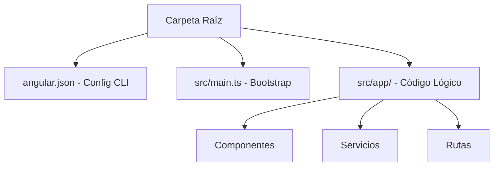

Angular es uno de los frameworks para el desarrollo web Frontend más utilizados en el mundo corporativo. En este artículo, abordaremos todo lo que necesitas saber para iniciar tu camino en este ecosistema estructurado y potente.

---

## ¿Qué es Angular?

Angular es un framework para el desarrollo de aplicaciones web de una sola página (SPA) basado en **TypeScript**. Mantenido por Google, está concebido bajo el enfoque de "baterías incluidas", lo que significa que de fábrica provee las herramientas necesarias para la gestión de rutas, cliente de red HTTP, validación de formularios y más, sin depender de librerías externas.

---

## Historia

Angular nació originalmente en 2010 como **AngularJS**, una librería de JavaScript que introdujo conceptos innovadores como el doble enlace de datos (two-way data binding). En 2016, ante las limitaciones de rendimiento y arquitectura de AngularJS, Google reescribió el framework por completo en TypeScript, naciendo lo que hoy conocemos simplemente como **Angular** (versión 2 en adelante). Desde entonces, el framework se actualiza de forma semestral sumando optimizaciones masivas como el compilador Ivy, renderizado híbrido y, más recientemente, **Signals**.

---

## Casos de uso

Angular es idóneo para:
- Aplicaciones empresariales de gran escala (Dashboards corporativos, CRMs, ERPs).
- Sistemas interactivos bancarios y de comercio digital donde la tipificación estricta de TypeScript previene fallos.
- Equipos de desarrollo numerosos que necesitan adherirse a una única estructura de diseño y código unificada.

---

## Instalación de Node y Angular CLI

Para comenzar, requerimos instalar **Node.js** (versión LTS recomendada) desde su web oficial. Node incluye **NPM** (Node Package Manager) que nos permitirá descargar paquetes.

<TerminalBlock title="Instalación del CLI de Angular" command="npm install -g @angular/cli" />

---

## Crear el primer proyecto y ng serve

Con el CLI instalado globalmente, podemos generar e inicializar nuestro servidor local de desarrollo con dos sencillos comandos:

<TerminalBlock title="Comandos para inicializar proyecto" command="ng new mi-app-angular && cd mi-app-angular && ng serve" />

Al levantar el servidor, abre tu navegador en <a href="http://localhost:4200/" target="_blank">http://localhost:4200/</a>.

---

## Estructura del proyecto

El andamiaje básico de carpetas divide responsabilidades claramente:



---

## Componentes y Templates

Un componente es el bloque de construcción fundamental en Angular. Se compone de un decorador `@Component` que enlaza la clase lógica TypeScript con su estructura HTML y estilos CSS.

```typescript
import { Component } from '@angular/core';

@Component({
  selector: 'app-saludo',
  standalone: true,
  template: `
    <div class="card">
      <h2>¡Hola, {{ usuario }}!</h2>
    </div>
  `,
  styles: ['.card { padding: 1rem; border: 1px solid #ccc; }']
})
export class SaludoComponent {
  usuario = 'Desarrollador';
}
```

---

## Data Binding

Angular ofrece diferentes métodos para comunicar el código lógico de TypeScript con la plantilla visual:

- **Interpolación**: `{{ valor }}` (Muestra datos del TS en el HTML).
- **Property Binding**: `[src]="imagenUrl"` (Pasa valores de variables a atributos HTML).
- **Event Binding**: `(click)="guardar()"` (Escucha eventos de la interfaz e invoca funciones).
- **Two-Way Binding**: `[(ngModel)]="nombre"` (Sincroniza datos de entrada bidireccionalmente).

---

## Servicios e Inyección de Dependencias

Los servicios centralizan la lógica de negocio y las llamadas a APIs externas para mantener los componentes ligeros y enfocados. La **Inyección de Dependencias** nos permite utilizar estos servicios en cualquier componente simplemente declarándolos en el constructor o mediante la función `inject()`.

```typescript
import { Injectable, inject } from '@angular/core';
import { HttpClient } from '@angular/common/http';

@Injectable({
  providedIn: 'root'
})
export class ArticuloService {
  private http = inject(HttpClient);

  getArticulos() {
    return this.http.get('/api/articulos');
  }
}
```

---

## Routing (Enrutado)

El sistema de enrutado nos permite definir qué componente mostrar según la dirección URL del navegador.

```typescript
import { Routes } from '@angular/router';
import { HomeView } from './home.component';
import { BlogView } from './blog.component';

export const routes: Routes = [
  { path: '', component: HomeView },
  { path: 'blog', component: BlogView }
];
```

---

## Buenas prácticas

<InfoBlock type="tip" title="Estructura e Inmutabilidad">
  - Divide tu aplicación en componentes pequeños y específicos (menores a 300 líneas de código).
  - Prefiere la sintaxis de **Signals** por encima de RxJS para variables de estado sencillas y de grano fino.
  - Utiliza el enrutamiento perezoso (Lazy Loading) para importar módulos bajo demanda y mejorar el tiempo de carga inicial.
</InfoBlock>

---

## Errores comunes

<InfoBlock type="error" title="Fugas de Memoria en Suscripciones">
  Un error clásico es suscribirse a un Observable de RxJS (ej. `http.get().subscribe()`) dentro de un componente y no cancelar la suscripción al destruir el componente. Esto consume memoria del navegador. Evítalo usando la tubería `async` en el HTML o pasándote al sistema moderno de Signals de Angular.
</InfoBlock>

---

## Preguntas frecuentes (FAQ)

<Accordion title="¿Es TypeScript obligatorio en Angular?">
  Sí. A diferencia de React o Vue que permiten programar en JavaScript puro de forma opcional, Angular está enteramente diseñado y construido sobre TypeScript para asegurar estabilidad y auto-completado tipado rígido.
</Accordion>

<Accordion title="¿Qué es Zone.js?">
  Es la librería que Angular utiliza para detectar eventos asíncronos y refrescar la pantalla de forma automática. Sin embargo, en las últimas versiones se ha introducido la posibilidad de omitir Zone.js (Zoneless) mediante el uso de Signals.
</Accordion>

---

## Conclusiones

Angular ofrece una plataforma disciplinada y unificada. Si bien su curva de aprendizaje puede parecer intimidante inicialmente, recompensa enormemente al estructurar proyectos de alta calidad capaces de mantenerse robustos a través del tiempo.

---

## Curso recomendado

Revisa este curso introductorio en video para familiarizarte visualmente con los comandos del framework:

<ArticleYoutube videoId="f7unUpshmpA" title="Curso de Angular para Principiantes" creator="Angular Community" />

---

## Checklist final de inicio rápido

<Checklist 
  title="Tu primer despliegue en Angular"
  items={[
    'Instalar Node.js LTS y verificar con node -v en tu terminal.',
    'Descargar el CLI oficial mediante npm install.',
    'Generar el andamiaje del proyecto con ng new.',
    'Levantar el servidor local y visualizar la landing en http://localhost:4200.'
  ]}
/>

---

## Recursos adicionales
- [Página oficial de documentación de Angular](https://angular.dev)
- [Repositorio oficial de Angular en GitHub](https://github.com/angular/angular)
