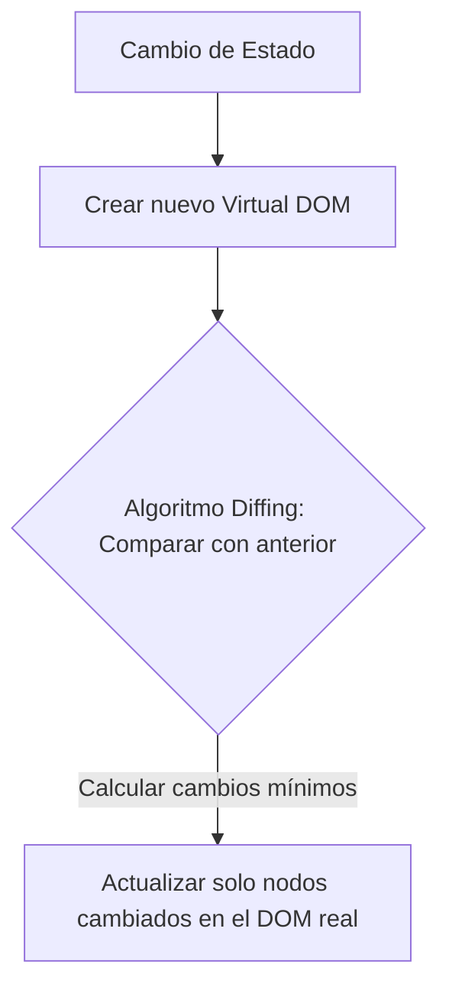

React es actualmente la biblioteca de interfaces de usuario más popular del ecosistema web. En este artículo aprenderás sus conceptos clave para dominar su forma de pensar y estructurar interfaces declarativas.

---

## ¿Qué es React?

React es una **biblioteca de JavaScript** creada por Meta (Facebook) en 2013. A diferencia de un framework monolítico como Angular, React se enfoca única y exclusivamente en la capa de la vista de las aplicaciones. Es declarativo, lo que significa que describes el estado visual deseado y React se encarga de pintar y actualizar la pantalla eficientemente.

---

## Virtual DOM

El DOM (Document Object Model) real del navegador es lento al recibir actualizaciones frecuentes. React soluciona esto introduciendo el **Virtual DOM**: una representación ligera en memoria del DOM real.



Este proceso de sincronización eficiente se denomina **Reconciliación**.

---

## JSX

JSX es una extensión sintáctica de JavaScript que permite escribir estructuras HTML directamente dentro de tus scripts JS/TS. No es HTML real, es azúcar sintáctico que se compila a llamadas de funciones de React.

<Tabs labels={['Sintaxis JSX', 'Compilación JS Real']}>
  <TabItem index={0}>
    ```jsx
    const elemento = (
      <div className="card">
        <h1>Hola Mundo</h1>
      </div>
    );
    ```
  </TabItem>
  <TabItem index={1}>
    ```javascript
    import { jsx as _jsx } from "react/jsx-runtime";
    
    const elemento = _jsx("div", {
      className: "card",
      children: _jsx("h1", { children: "Hola Mundo" })
    });
    ```
  </TabItem>
</Tabs>

---

## Componentes y Props

Un componente en React es simplemente una función que devuelve código JSX. Las **props** son parámetros inmutables que los componentes padres pasan a los componentes hijos para modificar su contenido.

```jsx
// Definición
function Tarjeta({ titulo, descripcion }) {
  return (
    <div class="card p-4 border border-white/10 rounded-xl">
      <h3 class="text-white font-bold">{titulo}</h3>
      <p class="text-text-muted text-sm">{descripcion}</p>
    </div>
  );
}

// Consumo
function App() {
  return <Tarjeta titulo="Curso de React" descripcion="Aprende Hooks y Context" />;
}
```

---

## Estado (State) y Hooks

El **Estado** representa la memoria interna de un componente. Cuando el estado cambia, el componente se re-renderiza para mostrar la información actualizada. Los **Hooks** son funciones especiales que permiten a los componentes funcionales conectarse al estado de React y sus ciclos de vida.

### useState

El hook `useState` añade una variable de estado a tu componente.

```jsx
import { useState } from 'react';

function Contador() {
  const [contador, setContador] = useState(0);

  return (
    <button onClick={() => setContador(prev => prev + 1)}>
      Clicks: {contador}
    </button>
  );
}
```

### useEffect

El hook `useEffect` permite ejecutar efectos secundarios en tus componentes (como peticiones HTTP, suscripciones o cambios manuales del DOM).

```jsx
import { useState, useEffect } from 'react';

function Usuario({ userId }) {
  const [usuario, setUsuario] = useState(null);

  useEffect(() => {
    fetch(`https://api.github.com/users/${userId}`)
      .then(res => res.json())
      .then(data => setUsuario(data));
  }, [userId]); // Se ejecuta cada vez que userId cambia

  if (!usuario) return <p>Cargando...</p>;
  return <p>Nombre: {usuario.name}</p>;
}
```

---

## Crear proyecto con Vite

Para andamiar tu proyecto de React de forma veloz e integrada con empaquetamiento optimizado, utiliza Vite:

<TerminalBlock title="Configuración de proyecto React" command="npm create vite@latest mi-react-app -- --template react-ts" />

Ingresa a la carpeta, instala dependencias y ejecuta el servidor local:

<TerminalBlock title="Levantar servidor local de desarrollo" command="cd mi-react-app && npm install && npm run dev" />

---

## Buenas prácticas

<InfoBlock type="tip" title="Inmutabilidad del Estado">
  Nunca modifiques o mutes el estado directamente. Por ejemplo, en lugar de hacer `lista.push(item); setLista(lista)`, prefiere usar la desestructuración de arrays para crear una nueva referencia: `setLista([...lista, item])`. Esto asegura que React detecte el cambio de referencia y vuelva a renderizar la UI de manera correcta.
</InfoBlock>

---

## Errores comunes

<CodeComparison beforeLabel="Mutación directa (Incorrecto)" afterLabel="Copia de referencia (Correcto)">
  <div slot="before">
    ```javascript
    const [info, setInfo] = useState({ edad: 20 });
    
    const cumpleaños = () => {
      info.edad = 21; // ERROR: Muta el estado original directamente
      setInfo(info);  // React no detecta cambio de referencia
    };
    ```
  </div>
  <div slot="after">
    ```javascript
    const [info, setInfo] = useState({ edad: 20 });
    
    const cumpleaños = () => {
      setInfo({
        ...info,      // Copia las propiedades anteriores
        edad: 21      // Actualiza la propiedad deseada
      });
    };
    ```
  </div>
</CodeComparison>

---

## Preguntas frecuentes (FAQ)

<Accordion title="¿Cuál es la diferencia entre Props y State?">
  Las **Props** son variables de entrada externas que el componente recibe de su padre y son de lectura obligatoria (inmutables). El **State** es local y gestionado de manera interna por el propio componente, y puede actualizarse mediante su función despachadora de estado correspondiente.
</Accordion>

<Accordion title="¿Qué es la Regla de los Hooks?">
  Los Hooks solo pueden ser invocados en el nivel superior de tus funciones componentes de React. Nunca los llames dentro de bucles condicionales (`if`), bucles iterativos (`for`) o funciones internas anidadas, ya que React depende del orden secuencial de llamada para asignar correctamente su estado interno.
</Accordion>

---

## Conclusiones

React proporciona un modelo de programación flexible y declarativo altamente enfocado en el uso de funciones y flujos de datos puros. Su sencillez conceptual y el amplio soporte de su comunidad lo convierten en la opción más dinámica para desarrollo ágil en la actualidad.

---

## Curso recomendado

Revisa este video explicativo para dominar el uso y ciclo de vida de los Hooks:

<ArticleYoutube videoId="7iobxzd_2wY" title="Curso de React para Principiantes" creator="React Community" />

---

## Checklist final de inicio rápido

<Checklist 
  title="Prerrequisitos de React"
  items={[
    'Comprender desestructuración y funciones flecha de JavaScript.',
    'Crear el proyecto react con Vite en tu terminal de comandos.',
    'Utilizar useState para gestionar el flujo de datos reactivos del componente.',
    'Ejecutar npm run dev para visualizar los resultados locales.'
  ]}
/>

---

## Recursos adicionales
- [Documentación oficial de React](https://react.dev)
- [Repositorio de React en GitHub](https://github.com/facebook/react)
