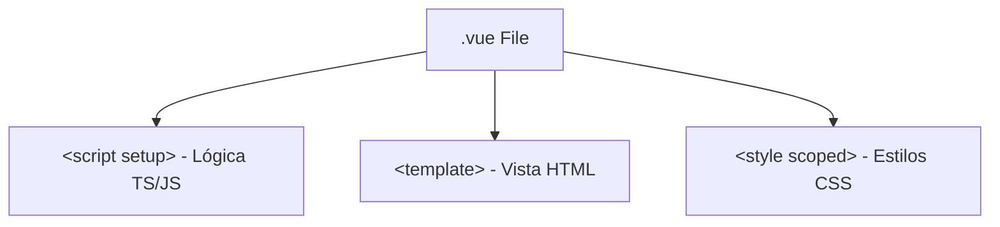

Vue.js es uno de los frameworks más queridos por la comunidad gracias a su equilibrio entre sencillez sintáctica, potencia y una curva de aprendizaje sumamente suave. En este artículo profundizaremos en sus fundamentos.

---

## ¿Qué es Vue?

Vue.js es un **framework progresivo de JavaScript** creado por Evan You en 2014. El término "progresivo" hace referencia a que se puede usar como una simple biblioteca agregada con un tag `<script>` en un archivo HTML plano, o escalar hasta convertirse en un framework robusto con compilación optimizada para coordinar proyectos a gran escala.

---

## Historia

Evan You creó Vue mientras trabajaba en Google utilizando AngularJS. Su idea original fue tomar las mejores características de Angular (como las directivas o el binding directo) y empaquetarlas en una librería sumamente ligera y amigable. Con el lanzamiento de **Vue 3** en 2020, el framework se reescribió en TypeScript e introdujo la reactividad mediante Proxy de ES6 y la potente **Composition API**.

---

## Composition API vs Options API

Vue admite dos formas principales de estructurar el código lógico de tus componentes:

- **Options API**: Organiza tu lógica en objetos predefinidos (`data`, `methods`, `computed`, `watch`). Excelente para principiantes.
- **Composition API**: Organiza la lógica agrupando funcionalidades coherentes mediante funciones nativas de reactividad (`ref`, `computed`). Se recomienda en proyectos avanzados y es más fácil de reutilizar.

<CodeComparison beforeLabel="Options API (Vue 2/3)" afterLabel="Composition API (Vue 3)">
  <div slot="before">
    ```javascript
    export default {
      data() {
        return { contador: 0 }
      },
      methods: {
        incrementar() {
          this.contador++
        }
      }
    }
    ```
  </div>
  <div slot="after">
    ```html
    <script setup>
    import { ref } from 'vue'
    
    const contador = ref(0)
    const incrementar = () => contador.value++
    </script>
    ```
  </div>
</CodeComparison>

---

## Directivas Reactivas

Las directivas son atributos especiales con el prefijo `v-` que permiten inyectar lógica de renderizado condicional, iteraciones y eventos directo en tus plantillas HTML.

```html
<template>
  <!-- Renderizado condicional -->
  <p v-if="cargando">Cargando datos...</p>

  <!-- Renderizado iterativo -->
  <ul v-else>
    <li v-for="item in articulos" :key="item.id">
      {{ item.titulo }}
    </li>
  </ul>
  
  <!-- Evento click -->
  <button @click="cargarArticulos">Recargar</button>
</template>
```

---

## Single File Components (SFC)

Vue popularizó los archivos `.vue` que contienen todo lo necesario para un componente en un único fichero:



---

## Computed y Watch

Las propiedades computadas y los observadores gestionan flujos dinámicos eficientes:

- **Computed**: Variables calculadas reactivamente que se memoizan (cachean) en memoria hasta que cambie alguna de sus dependencias.
- **Watch**: Ejecuta funciones o efectos secundarios en respuesta a cambios de variables específicas (útil para guardar configuraciones en LocalStorage o realizar fetching dinámico).

```typescript
import { ref, computed, watch } from 'vue'

const precio = ref(100)
const descuento = ref(10)

// Computed
const precioFinal = computed(() => precio.value - descuento.value)

// Watch
watch(precioFinal, (nuevoPrecio) => {
  console.log(`El precio final ha cambiado a: ${nuevoPrecio}`)
})
```

---

## Props y Emits

La comunicación de componentes en Vue sigue el patrón clásico: **Props** van hacia abajo (de padre a hijo), y **Events (Emits)** van hacia arriba (de hijo a padre).

```html
<!-- Componente Hijo -->
<script setup>
defineProps(['mensaje'])
const emit = defineEmits(['cerrar'])
</script>

<template>
  <div class="alerta">
    <p>{{ mensaje }}</p>
    <button @click="emit('cerrar')">Cerrar Alerta</button>
  </div>
</template>
```

---

## Ecosistema Oficial: Vue Router y Pinia

Para dotar a tu aplicación de una estructura robusta a escala de framework, Vue cuenta con librerías oficiales de alto nivel:

- **Vue Router**: Coordina la navegación dinámica del navegador y la carga perezosa de vistas.
- **Pinia**: La librería de gestión de estado global recomendada para Vue 3, simplificada e intuitiva (reemplazo de Vuex).

---

## Buenas prácticas

<InfoBlock type="tip" title="Scoped Styles y Composition Setup">
  - Encapsula siempre tus estilos CSS utilizando el atributo `scoped` en tus tags `<style>`. Esto evita que las reglas colisionen globalmente.
  - Prefiere la sintaxis `<script setup>` por encima de la función clásica `setup()`, ya que simplifica la declaración del código y ofrece un mejor autocompletado y tipado TypeScript.
</InfoBlock>

---

## Errores comunes

<InfoBlock type="warning" title="Desreferenciar Refs en JavaScript">
  Un error recurrente al usar la Composition API es olvidar añadir el sufijo `.value` al acceder o modificar variables declaradas mediante `ref()` dentro de tu bloque `<script>`. Recuerda: en tu código JS debes usar `contador.value = 5`, pero en tus plantillas HTML puedes consumirlo directamente como `{{ contador }}` ya que Vue realiza el desempaquetado automático.
</InfoBlock>

---

## Preguntas frecuentes (FAQ)

<Accordion title="¿Qué es el Virtual DOM en Vue?">
  Es un árbol virtual en memoria que imita al DOM real. Cuando se actualiza el estado de las variables reactivas de Vue, el framework calcula la diferencia (diff) entre el Virtual DOM nuevo y el antiguo, y actualiza selectivamente únicamente las etiquetas que cambiaron del DOM real del navegador.
</Accordion>

<Accordion title="¿Cuál es la diferencia entre ref y reactive?">
  `ref()` acepta cualquier tipo de dato (primitivos como strings o números, y objetos complejos) y requiere acceder mediante `.value`. `reactive()` solo acepta objetos y no necesita usar `.value`, pero pierde la reactividad al desestructurarse (ej. `{ x, y } = reactiveObj`). Por recomendación general, prefiere utilizar `ref()` de manera estándar.
</Accordion>

---

## Conclusiones

Vue.js ofrece un balance sensacional entre ligereza sintáctica y una API declarativa sumamente pulida. Su flexibilidad de andamiaje y la facilidad de uso de sus SFCs lo convierten en un estándar altamente productivo para cualquier Frontend Developer.

---

## Curso recomendado

Visualiza este curso interactivo guiado para asimilar la Composition API en minutos:

<ArticleYoutube videoId="9AHMihFhrzw" title="Curso de Vue.js para Principiantes" creator="Vue Community" />

---

## Checklist final de inicio rápido

<Checklist 
  title="Andamiaje inicial en Vue"
  items={[
    'Inicializar el proyecto vue rápido usando npm create vue@latest.',
    'Crear componentes reusables Single File Components (SFC).',
    'Conectar propiedades utilizando props y defineEmits para modularidad.',
    'Ejecutar npm run dev para levantar el entorno local de desarrollo.'
  ]}
/>

---

## Recursos adicionales
- [Documentación oficial de Vue.js](https://vuejs.org)
- [Repositorio oficial de Vue en GitHub](https://github.com/vuejs/core)
